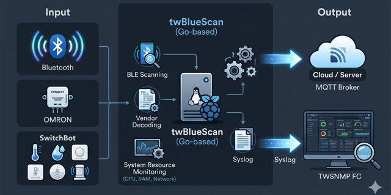

# twBlueScan

twBlueScan is a sensor program for Linux that monitors surrounding Bluetooth Low Energy (BLE) devices and environmental sensors. It supports popular smart home devices like SwitchBot and Omron, sending real-time data to TWSNMP FC or other IoT platforms via Syslog and MQTT.

[日本語の説明](./README_ja.md)

[](http://godoc.org/github.com/twsnmp/twBlueScan)
[](https://goreportcard.com/report/twsnmp/twBlueScan)



## Overview

A sensor program for Linux machines that collects information from nearby Bluetooth devices and sends it to TWSNMP FC or other systems via syslog or MQTT.

The collected information includes:

- Device address
- Address type (random/public)
- Name
- RSSI (Signal Strength)
- Manufacturer
- Information from Omron environmental sensors
- Sensor data from SwitchBot (temperature, humidity, etc.)

## Status

- 2021/08/29: Initial development started.
- 2021/09/02: v1.0.0 released.
- 2021/09/12: v2.0.0 switched to low-level package `bluewalker`.
- 2021/09/27: v2.1.0 added support for SwitchBot sensors and active mode scanning.
- 2026/03/20: v3.0.0 added MQTT support and automated release with GoReleaser.
- 2026/03/26: v3.1.0 added Inkbird sensor support, UUID tracking, and device count reporting.

## Build

You can build the project using GoReleaser or Make.

### Build with GoReleaser
```bash
goreleaser release --snapshot --clean
```

### Build with Make
```bash
$ make
```
Available targets:
- `all`: Build all executables (amd64, arm, arm64).
- `clean`: Remove built executables.
- `zip`: Create ZIP files for release.

Executables will be created in the `dist` directory.

## Usage

### Command Line Flags

```text
Usage of ./twBlueScan:
  -active
        Active scan mode
  -adapter string
        Monitor Bluetooth adapter (default "hci0")
  -addr string
        Make address to vendor map
  -all
        Report all details (including private addresses)
  -code string
        Make company code to vendor map
  -debug
        Debug mode
  -interval int
        Syslog send interval (sec) (default 600)
  -mqtt string
        MQTT broker destination (e.g., tcp://192.168.1.1:1883)
  -mqttClientID string
        MQTT client ID (default "twBlueScan")
  -mqttPassword string
        MQTT password
  -mqttTopic string
        MQTT topic (default "twBlueScan")
  -mqttUser string
        MQTT user name
  -syslog string
        Syslog destination list (comma-separated, e.g., 192.168.1.1:514)
```

### Configuration via Environment Variables
Each flag can also be set via environment variables prefixed with `TWBLUESCAN_` (e.g., `TWBLUESCAN_SYSLOG`).

### Requirements
The `bluez` package is required on Linux.
```bash
$ sudo apt update
$ sudo apt install bluez
```

Verify that the Bluetooth device is available:
```bash
# hcitool dev
Devices:
	hci0	00:E9:3A:89:8D:FE
```

### Execution Examples

```bash
# Sending to syslog
./twBlueScan -adapter hci0 -syslog 192.168.1.1

# Sending to MQTT (with active scan enabled)
./twBlueScan -active -mqtt tcp://192.168.1.1:1883 -mqttTopic myhome/ble
```

## Copyright

See [./LICENSE](./LICENSE).

```text
Copyright 2021-2026 Masayuki Yamai
```
